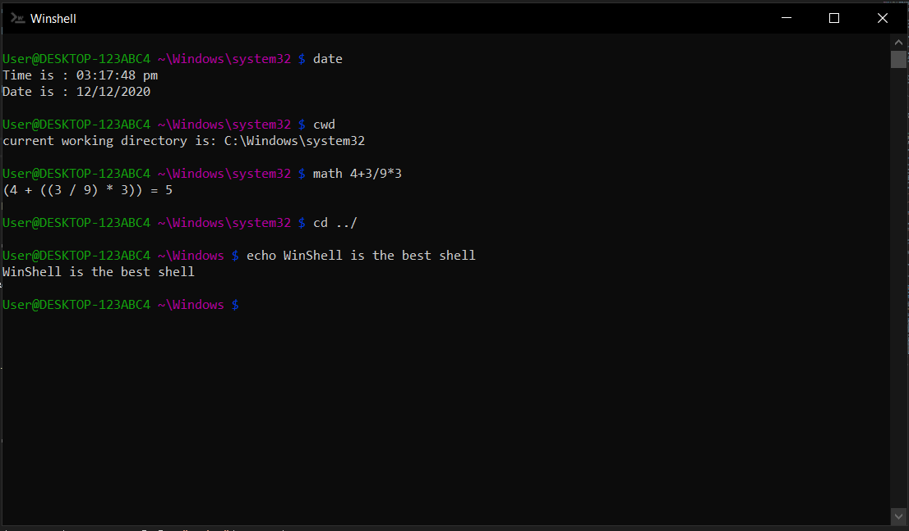

[](https://github.com/Duui3111/winshell/graphs/contributors)
[](https://github.com/duui3111/winshell/network/members)
[](https://github.com/duui3111/winshell/stargazers)
[](https://github.com/duui3111/winshell/issues)
[](https://github.com/duui3111/winshell/License)
[]()


<!-- PROJECT LOGO -->
<br />
<p align="center">
  <a href="https://github.com/duui3111/winshell">
    
  </a>

  <h3 align="center">winshell</h3>

  <p align="center">
    shell for windows with a termenal and the wsh language wich can be run with winshell
    <br />
    <a href="https://github.com/Duui3111/winshell/wiki"><strong>Explore the docs »</strong></a>
    <br />
    <br />
    <a href="https://github.com/Duui3111/winshell/blob/main/images/demo.gif">View Demo</a>
    ·
    <a href="https://github.com/duui3111/winshell/issues">Report Bug</a>
    ·
    <a href="https://github.com/duui3111/winshell/issues">Request Feature</a>
  </p>
</p>
<br>
<br>


## about the project

[](https://github.com/Duui3111/winshell)

### Built With
you will need to have this to build WinShell
* gcc
* g++
* windres
* msbuild

<!-- GETTING STARTED -->
## Getting Started
how to run from the srorce
```bat
> cd scripts
> build
```
or you can run with make by doing
```bat
> make build
```

<!-- USAGE EXAMPLES -->
## Usage
```bat
> cd [path]
> ls 
> ls [path]
> cls
> copy [from] [to]
> mkdir [dirname]
> rmdir [dirname]
> echo [text]
> cwd
> date
> math [the math]
> run [env var]
> exit
```
on how to run wsh languge 
```bat
> wsh_lang [filename]
```

<!-- ROADMAP -->
## Roadmap

See the [open issues](https://github.com/Duui3111/winshell/issues) for a list of proposed features (and known issues).


<!-- CONTRIBUTING -->
## Contributing

Contributions are what make the open source community such an amazing place to be learn, inspire, and create. Any contributions you make are **greatly appreciated**.

1. Fork the Project
2. Create your Feature Branch (`git checkout -b your-new-branch-name`)
3. Commit your Changes (`git commit -m 'what you have added'`)
4. Push to the Branch (`git push origin <add-your-branch-name>`)
5. Open a Pull Request


<!-- LICENSE -->
## License

Distributed under the pache-2.0 License License. See `LICENSE` for more information.
